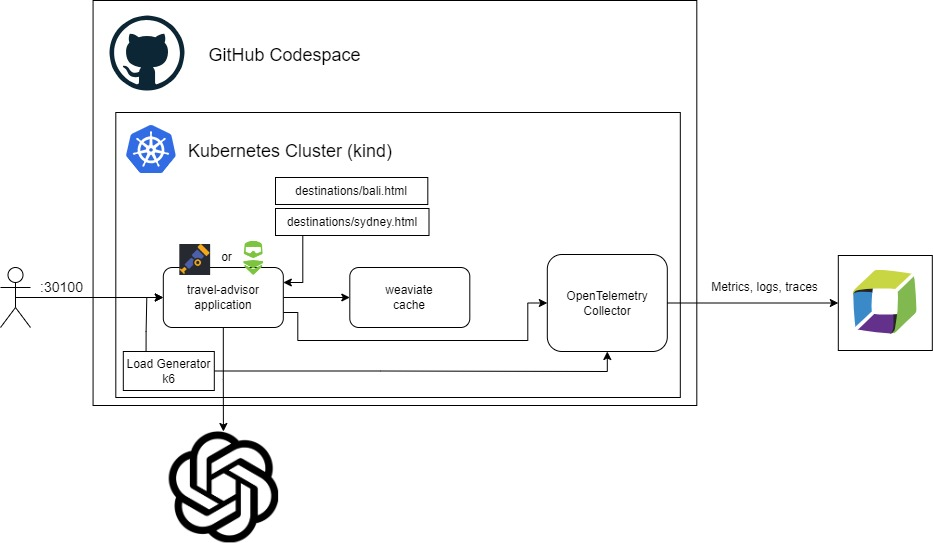
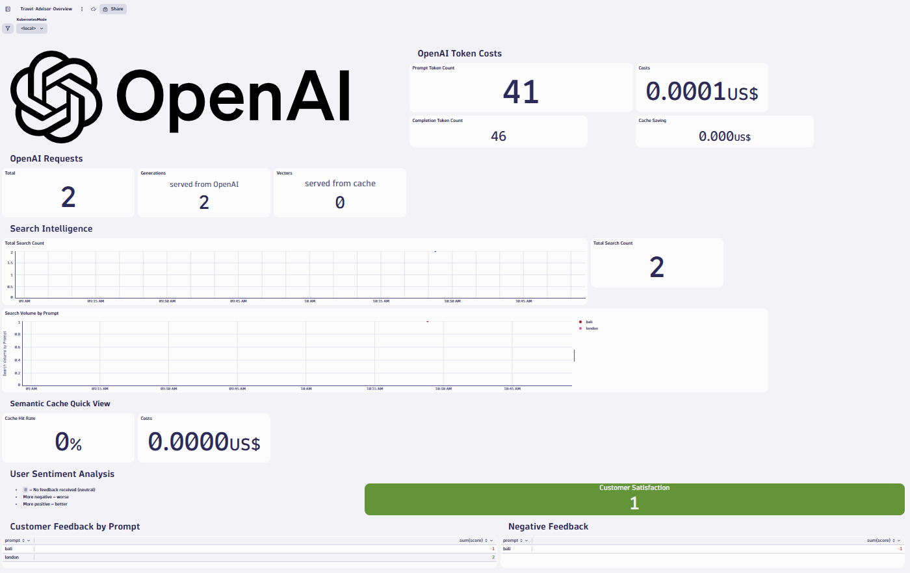
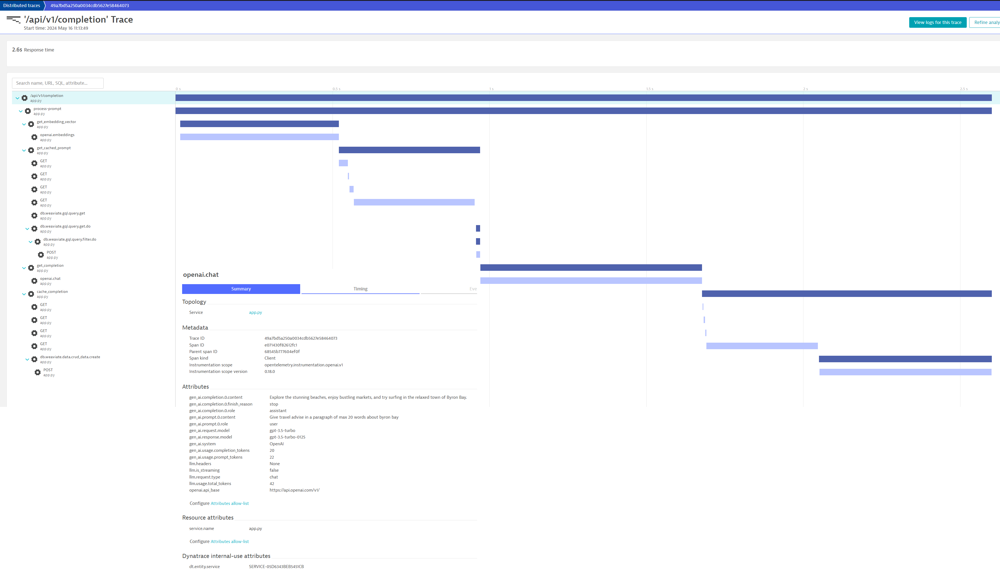

# EasyTravel GPT Travel Advisor

Demo Retrieval Augmented Generation (RAG) LLM application for giving travel advice.

Uses OpenAI ChatGPT to generate advice for a given destination.

To demonstrate that the RAG is answering from the custom data, the RAG is only trained on two destinations: [Bali](destinations/bali.html) and [Sydney](destinations/sydney.html).

The content is obviously false, again to demonstrate that the data really is pulling from the custom dataset.

- The application will use the contextual (training) information we have provided
- If data is available (ie. you have searched for either Bali or Sydney), data will be returned
- A message of "Sorry, I have no data on <destination>" will be returned for ALL other destinations




## How it works
The user interacts with the demo app (travel advisor) on port `30100`. The app is monitored either via native OpenTelemetry (as per the demo) or (if the user chooses) the OneAgent (eg. the nodeJS version). In both cases, the user enters a destination (eg. Sydney). The application first checks the cache. If a response for Sydney is found, the response is returned from the cache. If a cached response is not available, the application requests advice from the LLM (OpenAI's ChatGPT).

**The call to the LLM is enriched with the custom destination advice ([loaded from the HTML files](destinations)). The LLM is instructed to only provide an answer based on the provided context (ie. the file content)**.

When the response is returned, it is cached so that subsequent calls for the same destination (eg. Sydney) are served from the cache. This saves roundtrips to ChatGPT and thus $.

## ⚠️ OpenAI Paid Account Required

You need an OpenAI account with credit added to run this demo!

### Create OpenAI API Token

Go to `https://platform.openai.com/api-keys` and create a new API Key.

## Format Dynatrace URL

Make a note of your Dynatrace URL, it should be in the following format:

```
https://ENVIRONMENT-ID.live.dynatrace.com
```

For example:

```
https://abc12345.live.dynatrace.com
```

## Create Dynatrace Tokens

In Dynatrace, press `Ctrl + k` and search for `access tokens`. Choose the first option.

### DT_OPERATOR_TOKEN

Create a new access token with the following permissions:

- Create ActiveGate tokens
- Read entities
- Read Settings
- Write Settings
- Access problem and event feed, metrics, and topology
- Read configuration
- Write configuration
- PaaS integration - installer download

### DT_API_TOKEN

Create a second token with these permissions:

- Ingest metrics
- Ingest logs
- Ingest events
- Ingest OpenTelemetry
- Read metrics

### DT_WRITE_SETTINGS_TOKEN

Create a third token with this permission:

- Write settings

## 🔁 Recap

You should now have `5` pieces of information:

- The `DT_URL` (eg. `https://abc12345.live.dynatrace`)
- The `DT_OPERATOR_TOKEN`
- The `DT_API_TOKEN`
- The `DT_WRITE_SETTINGS_TOKEN`
- The `OPEN_AI_TOKEN`

When you have these pieces of information, you can proceed.

## 🆙 Time to Fire it up

- On the repo page of Github.com, click the green `Code` button and toggle to `Codespaces`.
- Click the "three dots" and choose "New with Options".
- Enter the values you've from above, in the form fields.
- Create the codespace.


After the codespaces has started (in a new browser tab), the post creation script should begin. This will install everything and will take a few moments.

When the script has completed, a success message will briefly be displayed (it is so quick you'll probably miss it) and an empty terminal window will be shown.


You may now proceed...

## Accessing and Using Demo

In the codespace, switch to the `Ports` tab. Right click port `30100` and choose `Open in Browser`


A new browser tab will open and you should see the demo.


## Visualising Data in Dynatrace

### Uploading the Dashboards
This demo comes with several prebuilt dashboards. Do the following in Dynatrace.

- Save the contents of [dynatrace/dashboards/openai/Travel-Advisor-Overview.json](dynatrace/dashboards/openai/Travel-Advisor-Overview.json) to your computer
- Press  `Ctrl + k` and search for `dashboards` or select the icon from the left toolbar
- Select the `Upload` button and upload the JSON file.




Repeat this process for the following dashboards:

- [dynatrace/dashboards/weaviate/Weaviate-Snapshots.json](dynatrace/dashboards/weaviate/Weaviate-Snapshots.json)
- [dynatrace/dashboards/weaviate/Weaviate-Importing-Data.json](dynatrace/dashboards/weaviate/Weaviate-Importing-Data.json)
- [dynatrace/dashboards/weaviate/Weaviate-LSM-Store.json](dynatrace/dashboards/weaviate/Weaviate-LSM-Store.json)
- [dynatrace/dashboards/weaviate/Weaviate-Object-Operations.json](dynatrace/dashboards/weaviate/Weaviate-Object-Operations.json)
- [dynatrace/dashboards/weaviate/Weaviate-Query-Performance.json](dynatrace/dashboards/weaviate/Weaviate-Query-Performance.json)
- [dynatrace/dashboards/weaviate/Weaviate-Usage.json](dynatrace/dashboards/weaviate/Weaviate-Usage.json)
- [dynatrace/dashboards/weaviate/Weaviate-Schema-Transactions.json](dynatrace/dashboards/weaviate/Weaviate-Schema-Transactions.json)
- [dynatrace/dashboards/weaviate/Weaviate-Startup-Times.json](dynatrace/dashboards/weaviate/Weaviate-Startup-Times.json)
- [dynatrace/dashboards/weaviate/Weaviate-Tombstone-Analysis.json](dynatrace/dashboards/weaviate/Weaviate-Tombstone-Analysis.json)
- [dynatrace/dashboards/weaviate/Weaviate-Vector-Index.json](dynatrace/dashboards/weaviate/Weaviate-Vector-Index.json)

## Run Locally with Weaviate Cache

- Download the [latest Weaviate binary from GitHub](https://github.com/weaviate/weaviate/releases/latest). Add it to your `PATH`.
- Download the [latest Dynatrace OpenTelemetry collector binary from GitHub](https://github.com/Dynatrace/dynatrace-otel-collector/releases). Add it to your `PATH`.

```
##### 1. Start Weaviate

set PROMETHEUS_MONITORING_ENABLED=true
weaviate --host 0.0.0.0 --port 8000 --scheme http

##### 2. Configure these variables and Start Collector
#####  Token needs: logs.ingest, metrics.ingest and openTelemetryTrace.ingest permissions

set DT_ENDPOINT=https://abc12345.live.dynatrace.com/api/v2/otlp
set API_TOKEN=dt0c01.******.******
dynatrace-otel-collector.exe --config ./run-locally/otelcol-config.yaml

##### Start app
set OPENAI_API_KEY=sk-proj-**********
set WEAVIATE_ENDPOINT=http://localhost:8000
# Disable usage telemetry that is sent to Traceloop
set TRACELOOP_TELEMETRY=false
python app.py
```


